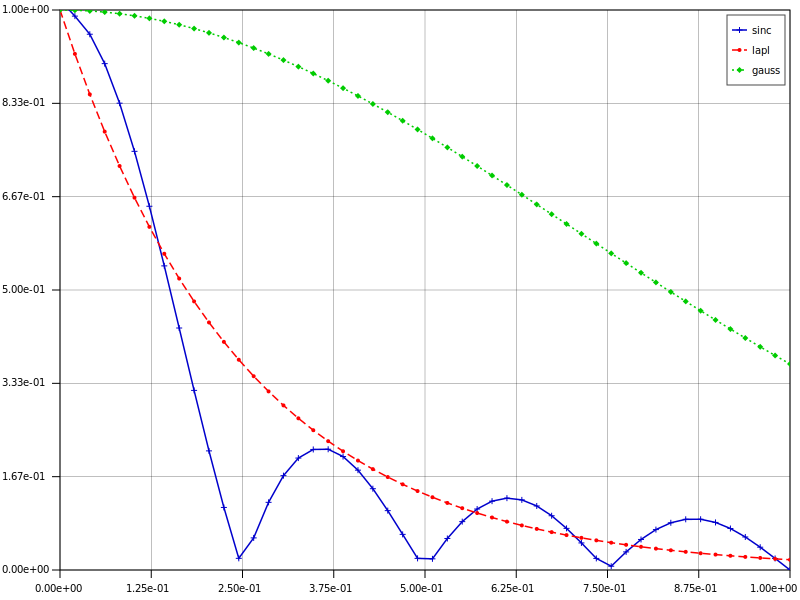
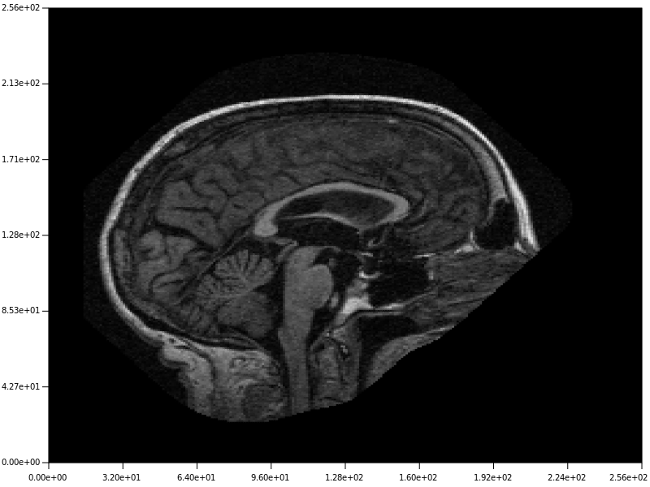
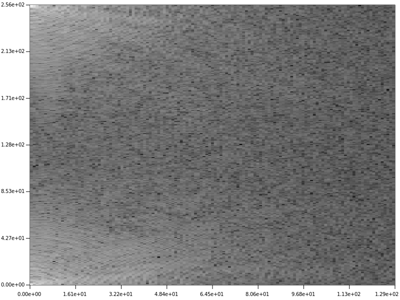

# Plotty: a simple C++/GTK3 plot and math lib
Author: Martino Ferrari <manda.mgf@gmail.com>

## Features

Current fetures includes:
 - Simple plot with color, line and point style customization
 - Simple matrix viewer with different color map useful for images
 - Scale, label, grid customization, multiple figure
 - Export in PNG and PDF (vectorial)
 - Integration with Eigen3 C++ library, for fast matrix operations
 - Basic mathematics operation and function supported
 - FFT/IFFT and FFT2/IFFT implementation using FFTW3 library
 - Support of many image formats using CImg library


## Examples

To compute and plot a simple signal is quite simple:

```c++
#include "plotty.h"
#include "math.h"
#include <Eigen/Core>
#include <gtkmm/application.h>

int main(int argc, char** argv)
{

  auto app = Gtk::Application::create(argc, argv, "org.gtkmm.example");

  // create linear space to use as x vector
  Eigen::VectorXd x = m::linspace(-1, 1, 100);
  // compute a gaussian
  Eigen::VectorXd gauss = m::exp(-(m::pow(x,2)));

  // create the window figure
  Figure f;

  // plot the data
  f.plt.plot(x, gauss, GREEN, 1.5, LS_DOTS_KEY, PS_DIAMOND, "gauss");
  // show the legend
  f.plt.legend();

  return app->run(f);
}
```

Few more examples are located in the folder examples of the project.

## Screenshots

A simple plot:



2D Image:



Magnetude of the 2D fft of the image:




